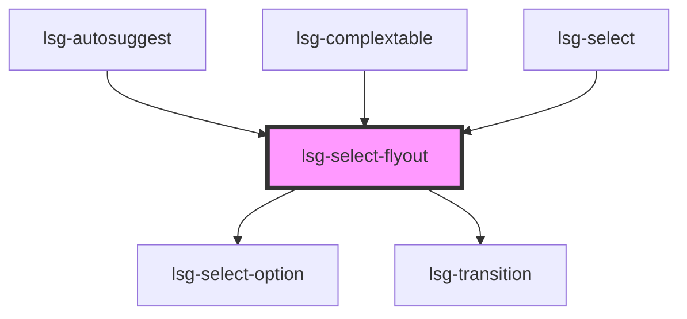

# lsg-select-flyout

<lsg-button id="|~id#1~|" onclick="document.getElementById('|~id#2~|').toggleOpen()">Open Flyout</lsg-button>
<lsg-select-flyout id="|~id#2~|" toggle-id="|~id#1~|">
  <lsg-select-option value="Auto">Auto</lsg-select-option>
  <lsg-select-option value="Schiff">Schiff</lsg-select-option>
  <lsg-select-option value="Haus">Haus</lsg-select-option>
  <lsg-select-option value="Flugzeug">Flugzeug</lsg-select-option>
</lsg-select-flyout>

<!-- Auto Generated Below -->

## Properties

| Property           | Attribute             | Description                                                                                                                                                  | Type                      | Default     |
| ------------------ | --------------------- | ------------------------------------------------------------------------------------------------------------------------------------------------------------ | ------------------------- | ----------- |
| `emptyListLabel`   | `empty-list-label`    | Text that will be shown in a withTextField select when no option matches the user input                                                                      | `string`                  | `undefined` |
| `isToggleElmWidth` | `is-toggle-elm-width` | Shall the flyout have the same width as the toggle element?                                                                                                  | `boolean`                 | `true`      |
| `noAutoFocus`      | `no-auto-focus`       | Select-flyout will autofocus by default. You can disable this behaviour. Make sure you attach keyhandling (use select-flyout method .handleKey()) if you do. | `boolean`                 | `undefined` |
| `onOpenChange`     | --                    | Register callback to keep open states sync                                                                                                                   | `(open: boolean) => void` | `undefined` |
| `open`             | `open`                | Set open state of select-flyout - you can also use .setOpen() or .toggleOpen() functions                                                                     | `boolean`                 | `undefined` |
| `selectedOptionId` | `selected-option-id`  |                                                                                                                                                              | `string`                  | `undefined` |
| `toggleId`         | `toggle-id`           | Id of the element that shall toggle the select-flyout. Used for positioning and setting aria-attributes                                                      | `string`                  | `undefined` |

## Events

| Event                        | Description                                                                                         | Type               |
| ---------------------------- | --------------------------------------------------------------------------------------------------- | ------------------ |
| `selectFlyoutOptionSelected` | Will be emitted when an option is selected. Passes id and value of selected option in event.details | `CustomEvent<any>` |

## Methods

### `filterItems(testFn: (item: string) => boolean) => Promise<void>`

#### Returns

Type: `Promise<void>`

### `handleKey(ev: any) => Promise<void>`

#### Returns

Type: `Promise<void>`

### `setOpen(setTo: boolean) => Promise<boolean>`

#### Returns

Type: `Promise<boolean>`

### `setSelectedItemIfExists(value: string) => Promise<void>`

#### Returns

Type: `Promise<void>`

### `toggleOpen() => Promise<boolean>`

#### Returns

Type: `Promise<boolean>`

## Dependencies

### Used by

 - [lsg-autosuggest](..\autosuggest)
 - [lsg-complextable](..\complextable)
 - [lsg-select](..\select)

### Depends on

- [lsg-select-option](..\select-option)
- [lsg-transition](..\transition)

### Graph

----------------------------------------------

*Built with [StencilJS](https://stenciljs.com/)*
