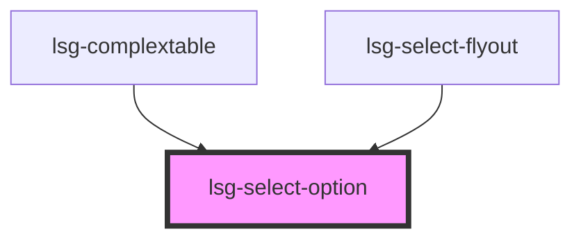

# lsg-select-option

<!-- Auto Generated Below -->

## Properties

| Property    | Attribute   | Description                                                                            | Type      | Default     |
| ----------- | ----------- | -------------------------------------------------------------------------------------- | --------- | ----------- |
| `hidden`    | `hidden`    |                                                                                        | `boolean` | `false`     |
| `highlight` | `highlight` |                                                                                        | `boolean` | `false`     |
| `readonly`  | `readonly`  | Readonly state has no hover and no click interactivity                                 | `boolean` | `false`     |
| `selected`  | `selected`  | Set selected to set an element to be chosen by default                                 | `boolean` | `false`     |
| `value`     | `value`     | Set the value of the option. Will be used as select value when the option is selected. | `string`  | `undefined` |

## Events

| Event                 | Description                               | Type               |
| --------------------- | ----------------------------------------- | ------------------ |
| `selectOptionClicked` | will be emitted when an option is clicked | `CustomEvent<any>` |
| `selectOptionHovered` | will be emitted when an option is hovered | `CustomEvent<any>` |

## Dependencies

### Used by

 - [lsg-complextable](..\complextable)
 - [lsg-select-flyout](..\select-flyout)

### Graph

----------------------------------------------

*Built with [StencilJS](https://stenciljs.com/)*
