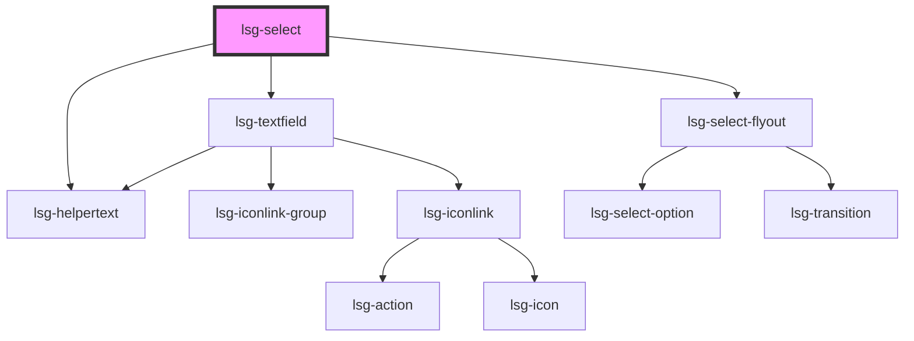

# lsg-select

<lsg-select helper-text="Everybody should have a hero.">
    <lsg-select-option value="hero1">Ant-Man</lsg-select-option>
    <lsg-select-option value="hero2">Aquaman</lsg-select-option>
    <lsg-select-option value="hero3">Asterix</lsg-select-option>
    <lsg-select-option value="hero4">The Atom</lsg-select-option>
    <lsg-select-option value="hero5">The Avengers</lsg-select-option>
    <lsg-select-option value="hero6">Batgirl</lsg-select-option>
    <lsg-select-option value="hero7">Batman</lsg-select-option>
    <lsg-select-option value="hero8">Batwoman</lsg-select-option>
    <lsg-select-option value="hero9">Black Canary</lsg-select-option>
    <lsg-select-option value="hero10">Black Panther</lsg-select-option>
    <lsg-select-option value="hero11">Captain America</lsg-select-option>
    <lsg-select-option value="hero12">Catwoman</lsg-select-option>
    <lsg-select-option value="hero13">Conan the Barbarian</lsg-select-option>
    <lsg-select-option value="hero14">Daredevil</lsg-select-option>
    <lsg-select-option value="hero15">The Defenders</lsg-select-option>
    <lsg-select-option value="hero16">Doc Savage</lsg-select-option>
    <lsg-select-option value="hero17">Doctor Strange</lsg-select-option>
    <lsg-select-option value="hero18">Elektra</lsg-select-option>
    <lsg-select-option value="hero19">Fantastic Four</lsg-select-option>
    <lsg-select-option value="hero20">Ghost Rider</lsg-select-option>
    <lsg-select-option value="hero21">Green Arrow</lsg-select-option>
    <lsg-select-option value="hero22">Green Lantern</lsg-select-option>
    <lsg-select-option value="hero23">Guardians of the Galaxy</lsg-select-option>
    <lsg-select-option value="hero24">Hawkeye</lsg-select-option>
    <lsg-select-option value="hero25">Hellboy</lsg-select-option>
    <lsg-select-option value="hero26">Incredible Hulk</lsg-select-option>
    <lsg-select-option value="hero27">Iron Fist</lsg-select-option>
    <lsg-select-option value="hero28">Iron Man</lsg-select-option>
    <lsg-select-option value="hero29">Marvelman</lsg-select-option>
    <lsg-select-option value="hero30">Robin</lsg-select-option>
    <lsg-select-option value="hero31">The Rocketeer</lsg-select-option>
    <lsg-select-option value="hero32">The Shadow</lsg-select-option>
    <lsg-select-option value="hero33">Spider-Man</lsg-select-option>
    <lsg-select-option value="hero34">Sub-Mariner</lsg-select-option>
    <lsg-select-option value="hero35">Supergirl</lsg-select-option>
    <lsg-select-option value="hero36">Superman</lsg-select-option>
    <lsg-select-option value="hero37">Teenage Mutant Ninja Turtles</lsg-select-option>
    <lsg-select-option value="hero38">The Wasp</lsg-select-option>
    <lsg-select-option value="hero39">Watchmen</lsg-select-option>
    <lsg-select-option value="hero40">Wolverine</lsg-select-option>
    <lsg-select-option value="hero41">Wonder Woman</lsg-select-option>
    <lsg-select-option value="hero42">X-Men</lsg-select-option>
    <lsg-select-option value="hero43">Zatanna</lsg-select-option>
    <lsg-select-option value="hero44">Zatara</lsg-select-option>
</lsg-select>
<lsg-select with-text-input>
    <lsg-select-option value="hero1">Ant-Man</lsg-select-option>
    <lsg-select-option value="hero2">Aquaman</lsg-select-option>
    <lsg-select-option value="hero3">Asterix</lsg-select-option>
    <lsg-select-option value="hero4">The Atom</lsg-select-option>
    <lsg-select-option value="hero5">The Avengers</lsg-select-option>
    <lsg-select-option value="hero6">Batgirl</lsg-select-option>
    <lsg-select-option value="hero7">Batman</lsg-select-option>
    <lsg-select-option value="hero8">Batwoman</lsg-select-option>
    <lsg-select-option value="hero9">Black Canary</lsg-select-option>
    <lsg-select-option value="hero10">Black Panther</lsg-select-option>
    <lsg-select-option value="hero11">Captain America</lsg-select-option>
    <lsg-select-option value="hero12">Catwoman</lsg-select-option>
    <lsg-select-option value="hero13">Conan the Barbarian</lsg-select-option>
    <lsg-select-option value="hero14">Daredevil</lsg-select-option>
    <lsg-select-option value="hero15">The Defenders</lsg-select-option>
    <lsg-select-option value="hero16">Doc Savage</lsg-select-option>
    <lsg-select-option value="hero17">Doctor Strange</lsg-select-option>
    <lsg-select-option value="hero18">Elektra</lsg-select-option>
    <lsg-select-option value="hero19">Fantastic Four</lsg-select-option>
    <lsg-select-option value="hero20">Ghost Rider</lsg-select-option>
    <lsg-select-option value="hero21">Green Arrow</lsg-select-option>
    <lsg-select-option value="hero22">Green Lantern</lsg-select-option>
    <lsg-select-option value="hero23">Guardians of the Galaxy</lsg-select-option>
    <lsg-select-option value="hero24">Hawkeye</lsg-select-option>
    <lsg-select-option value="hero25">Hellboy</lsg-select-option>
    <lsg-select-option value="hero26">Incredible Hulk</lsg-select-option>
    <lsg-select-option value="hero27">Iron Fist</lsg-select-option>
    <lsg-select-option value="hero28">Iron Man</lsg-select-option>
    <lsg-select-option value="hero29">Marvelman</lsg-select-option>
    <lsg-select-option value="hero30">Robin</lsg-select-option>
    <lsg-select-option value="hero31">The Rocketeer</lsg-select-option>
    <lsg-select-option value="hero32">The Shadow</lsg-select-option>
    <lsg-select-option value="hero33">Spider-Man</lsg-select-option>
    <lsg-select-option value="hero34">Sub-Mariner</lsg-select-option>
    <lsg-select-option value="hero35">Supergirl</lsg-select-option>
    <lsg-select-option value="hero36">Superman</lsg-select-option>
    <lsg-select-option value="hero37">Teenage Mutant Ninja Turtles</lsg-select-option>
    <lsg-select-option value="hero38">The Wasp</lsg-select-option>
    <lsg-select-option value="hero39">Watchmen</lsg-select-option>
    <lsg-select-option value="hero40">Wolverine</lsg-select-option>
    <lsg-select-option value="hero41">Wonder Woman</lsg-select-option>
    <lsg-select-option value="hero42">X-Men</lsg-select-option>
    <lsg-select-option value="hero43">Zatanna</lsg-select-option>
    <lsg-select-option value="hero44">Zatara</lsg-select-option>
</lsg-select>
<lsg-select invalid error-text="This select has an error">
    <lsg-select-option key="hero1" value="hero1">Ant-Man</lsg-select-option>
    <lsg-select-option key="hero2" value="hero2">Aquaman</lsg-select-option>
    <lsg-select-option key="hero3" value="hero3">Asterix</lsg-select-option>
    <lsg-select-option key="hero4" value="hero4">The Atom</lsg-select-option>
</lsg-select>
<lsg-select disabled label="Disabled select" optional>
    <lsg-select-option value="hero1">Ant-Man</lsg-select-option>
    <lsg-select-option value="hero2">Aquaman</lsg-select-option>
    <lsg-select-option value="hero3">Asterix</lsg-select-option>
    <lsg-select-option value="hero4">The Atom</lsg-select-option>
</lsg-select>
<lsg-select helper-text="This select has a helper text and Aquaman is preselected">
    <lsg-select-option value="hero1">Ant-Man</lsg-select-option>
    <lsg-select-option value="hero2" selected>Aquaman</lsg-select-option>
    <lsg-select-option value="hero3">Asterix</lsg-select-option>
    <lsg-select-option value="hero4">The Atom</lsg-select-option>
</lsg-select>
<lsg-select helper-text="This select has a helper text and Aquaman is preselected in another way" value="hero2">
    <lsg-select-option value="hero1">Ant-Man</lsg-select-option>
    <lsg-select-option value="hero2">Aquaman</lsg-select-option>
    <lsg-select-option value="hero3">Asterix</lsg-select-option>
    <lsg-select-option value="hero4">The Atom</lsg-select-option>
</lsg-select>

<!-- Auto Generated Below -->

## Properties

| Property         | Attribute          | Description                                                                             | Type      | Default     |
| ---------------- | ------------------ | --------------------------------------------------------------------------------------- | --------- | ----------- |
| `disabled`       | `disabled`         | Sets the textfield & style to disabled.                                                 | `boolean` | `undefined` |
| `emptyListLabel` | `empty-list-label` | Text that will be shown in a withTextField select when no option matches the user input | `string`  | `undefined` |
| `errorText`      | `error-text`       | Sets the error text.                                                                    | `string`  | `""`        |
| `helperText`     | `helper-text`      | Sets the helper text.                                                                   | `string`  | `""`        |
| `invalid`        | `invalid`          | Sets textfield & style to 'error'. 'errorText' becomes visible if set.                  | `boolean` | `undefined` |
| `label`          | `label`            | The label of the select dropdown                                                        | `string`  | `undefined` |
| `name`           | `name`             | The name of the select dropdown (used for form submit)                                  | `string`  | `undefined` |
| `open`           | `open`             | If the select-flyout is shown or not                                                    | `boolean` | `false`     |
| `optional`       | `optional`         | if the field is optional, the text "(optional)" is appended to the label                | `boolean` | `undefined` |
| `placeholder`    | `placeholder`      | The placeholder to be shown when no input is in the textinput                           | `string`  | `undefined` |
| `readonly`       | `readonly`         | Sets the textfield & style to read-only.                                                | `boolean` | `undefined` |
| `value`          | `value`            | The value of the select dropdown                                                        | `string`  | `undefined` |
| `withTextInput`  | `with-text-input`  | If enabled, this will be an input with a suggestion list                                | `boolean` | `undefined` |

## Events

| Event                  | Description                                      | Type               |
| ---------------------- | ------------------------------------------------ | ------------------ |
| `change`               | Will be emitted when an option has been selected | `CustomEvent<any>` |
| `selectOptionSelected` | Will be emitted when an option has been selected | `CustomEvent<any>` |

## Dependencies

### Depends on

- [lsg-textfield](..\textfield)
- [lsg-helpertext](..\helpertext)
- [lsg-select-flyout](..\select-flyout)

### Graph

----------------------------------------------

*Built with [StencilJS](https://stenciljs.com/)*
